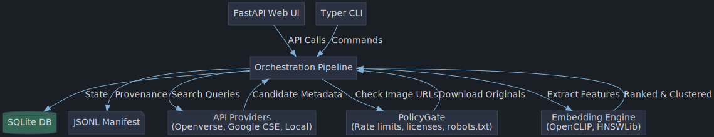
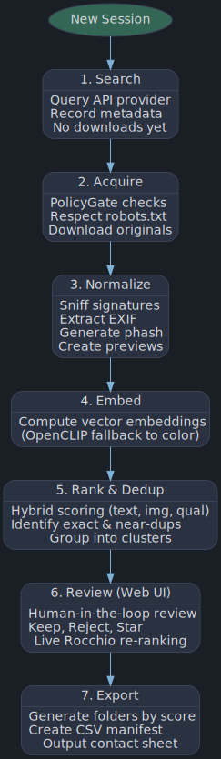
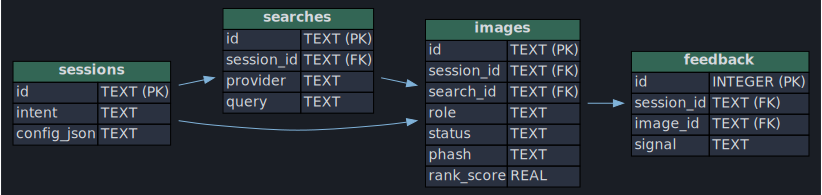
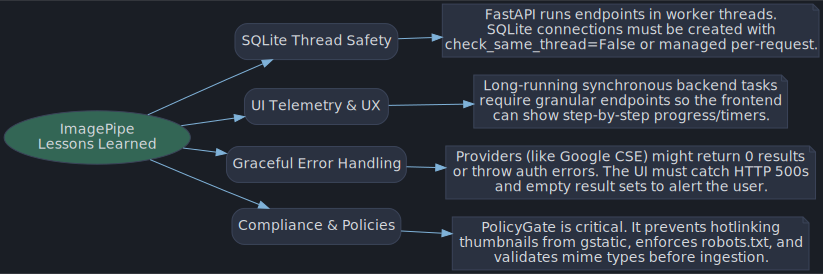

<div align="center">
  
  
  # imagepipe

  [](https://www.python.org/downloads/release/python-3110/)
  [](https://opensource.org/licenses/MIT)
  [](https://fastapi.tiangolo.com/)
  [](https://www.sqlite.org/index.html)
</div>

A compliant image discovery → similarity → acquisition → dedup → classify → sort pipeline. Python 3.11+, SQLite, JSONL provenance, Pillow, imagehash, optional PyTorch/OpenCLIP, optional hnswlib, Typer CLI, FastAPI review UI.

## 1. Architecture overview

```
[A. Input/session]                    [B. Acquisition]
 uploads / URLs / screenshot crops     Google CSE (searchType=image)
 text prompt, intent                   Openverse API / local_dir
        |                                    |
        v                                    v
  SQLite session + JSONL manifest ---> PolicyGate (robots, allow/block,
        |                              license, no thumbnail-cache) -> download
        v                                    |
[C. Normalize]  signature sniff, EXIF transpose, previews, phash, colors, quality
        |
[D. Embed/Rank] OpenCLIP (or fallback features) -> hnswlib/np index
                hybrid score: img-sim + txt-sim + quality + license + trust + feedback − dup penalty
        |
[E. Label]      CLIP zero-shot tags (photo/illustration/watermark/stock/...) + user labels
[F. Dedup]      sha256 exact + phash near-dup groups (keeper = best quality),
                greedy embedding clustering
        |
[G. Review UI]  FastAPI grid: keep/reject/more-like/less-like/★/? -> Rocchio re-rank
        |
[H. Export]     folders by score|feedback|cluster|domain|license|dedup
                + CSV manifest + HTML contact sheet + reproducible run manifest
```

Module map (API boundaries):

| Module | Responsibility | Public surface |
|---|---|---|
| `config.py` | typed config, conservative defaults | `Config`, `load_config` |
| `db.py` | schema, connection | `connect`, `create_session` |
| `policy.py` | every download decision | `PolicyGate.check_download` |
| `acquire.py` | provider search + download | `PROVIDERS`, `download` |
| `normalize.py` | validation/EXIF/phash/previews | `normalize` |
| `similarity.py` | embeddings, ANN index, ranking, feedback math | `get_backend`, `VectorIndex`, `rank_score` |
| `dedup_label.py` | dup groups, keepers, clustering, zero-shot labels | `dup_groups`, `pick_keepers`, `cluster_embeddings` |
| `pipeline.py` | orchestration + JSONL manifest | `Session` |
| `cli.py` / `webui.py` | Typer CLI / FastAPI UI | commands / HTTP API |

## 2. Data model

Tables (`db.py`): `sessions` (intent, frozen config), `searches` (provider, query, params), `images` (role=reference|candidate|screenshot_crop; full provenance: image_url, source_page_url, license, api_source, query_used, retrieved_at; file facts: sha256, phash, EXIF, colors, quality; ranking: sim_image, sim_text, rank_score, cluster_id, dup_group, is_dup_keeper; status pending|downloaded|rejected + reject_reason), `embeddings` (float32 blob per image), `labels` (auto|user|classifier), `feedback` (signal per image). Every event is also appended to `sessions/<id>/manifest.jsonl`.

## 3. Step-by-step pipeline

1. `new` — create session, freeze config into DB + manifest.
2. `add-ref` / `crop-screenshot` — register references. Screenshot crops are used **only** as embedding queries, never downloaded from.
3. `search` — provider API call with pagination, `Retry-After` handling, ≤0.5 rps default; candidates recorded with full metadata, no downloads yet.
4. `download` — each pending candidate passes `PolicyGate` (URL sanity, thumbnail-cache block, allow/block lists, robots.txt, license requirement), size limits; rejections logged with reason.
5. Normalize — signature sniff vs claimed MIME, corrupt/tiny/blank rejection, EXIF orientation, 512px preview, phash, sha256, color stats, quality score.
6. `rank` — embed references + candidates (+ text prompt), hybrid score, sha/phash dup groups with per-group keeper, embedding clusters, Rocchio feedback vector from user signals.
7. `label` — CLIP zero-shot tags (needs OpenCLIP backend).
8. `ui` — review grid; feedback → re-rank live.
9. `export` — sorted folders, `export_manifest.csv`, `contact_sheet.html`; originals kept untouched; rejected dupes remain recorded, never deleted.

## 4. Install

```bash
pip install pillow imagehash httpx typer fastapi uvicorn numpy hnswlib
# optional, for real embeddings + zero-shot labels + text similarity:
pip install torch open_clip_torch
```
Without torch the pipeline auto-falls back to a color/gradient feature backend (image-to-image similarity works; text similarity is 0).

## 5. Example CLI session

```bash
export GOOGLE_CSE_KEY=... GOOGLE_CSE_CX=...          # for provider=google_cse
SID=$(python -m imagepipe.cli new --intent "rectangular black-dial vintage dress watch, real photos" -c configs/example.json)

python -m imagepipe.cli add-ref $SID watch1.jpg watch2.jpg watch3.jpg -c configs/example.json
python -m imagepipe.cli crop-screenshot $SID results_screenshot.png --boxes "40,120,300,380;320,120,580,380" -c configs/example.json

python -m imagepipe.cli search $SID "antique silver wristwatch rectangular case black dial" --limit 40 -c configs/example.json
python -m imagepipe.cli search $SID "vintage dress watch rectangular black dial photo" --limit 40 -c configs/example.json
python -m imagepipe.cli download $SID -c configs/example.json
python -m imagepipe.cli rank $SID --prompt "high resolution photo of a rectangular black dial vintage dress watch, not a render, no watermark" -c configs/example.json
python -m imagepipe.cli label $SID -c configs/example.json     # if CLIP installed
python -m imagepipe.cli ui $SID -c configs/example.json        # http://127.0.0.1:8787
python -m imagepipe.cli export $SID --strategy feedback --top 200 -c configs/example.json
```

## 6. UI behavior

Grid of cards: preview, rank score with img/txt components (the "reason for ranking"), dimensions, source domain, license, dup marker, link to source page, buttons Keep / Reject / More like this / Less / ★ / ?. Toolbar: "Re-rank with feedback" (Rocchio update, live), "Export by feedback/score". Batch semantics: export copies keepers/rejects/uncertain into folders and writes the manifest.

## 7. Test plan

- `tests/test_e2e.py` (offline, passes): synthetic corpus via `local_dir` provider; asserts tiny/blank rejection, exact+near dup grouping with single keeper, reference-driven ranking puts the matching cluster first, `more_like_this` feedback raises scores, export artifacts exist, manifest contains all lifecycle events; unit checks that PolicyGate blocks gstatic thumbnail caches and blocklisted domains.
- Suggested additions: robots.txt fixture server; 429/Retry-After mock for `_get_with_retry`; CSE/Openverse response fixtures; CLIP-backend text-ranking test; UI API tests via `fastapi.testclient`.

## 8. Failure modes & mitigations

| Failure | Mitigation |
|---|---|
| API quota exhausted / 429 | Retry-After honored, exponential backoff, `max_results` cap, quota visible in manifest |
| Hotlink-blocked / 403 downloads | logged `http_403`, image skipped; user can open source page manually |
| Corrupt/mislabelled files | signature sniff + Pillow load + blank/tiny checks before anything else |
| Duplicate flood | sha256 + phash groups, keeper selection, dup penalty in ranking |
| Fallback backend (no CLIP) | text sim degrades to 0 gracefully; ranking still uses image sim/quality/feedback |
| robots.txt unreachable | conservative-permissive with note; domain can be blocklisted |
| Feedback overfit | Rocchio negative weight capped at 0.5; weights configurable |
| Data loss | originals immutable, exports are copies, JSONL append-only, rejected records preserved |

## 9. Compliance notes

- **No Google Images page scraping.** Acquisition uses only the official Custom Search JSON API (`searchType=image`) or Openverse. There is no browser automation, no CAPTCHA/anti-bot handling, no proxy rotation, no fake user agents (a single honest `imagepipe/0.1` UA is sent).
- **Thumbnails are never canonical.** `policy.py` hard-blocks gstatic/googleusercontent cache domains; downloads target original image URLs only.
- **robots.txt, rate limits, terms.** Per-domain robots checked before download; default 1 request / 2 s; allow/block lists; `require_license` + CSE `rights` filter for reusable-image workflows.
- **Provenance preserved.** Every candidate, decision, rejection reason, download, ranking pass, feedback event, and export is appended to `manifest.jsonl`; exports include a CSV linking each file to its source URL, page, license, query, and API.
- **Screenshot crops** are extracted only from the user's own screenshot and used only as embedding queries. No watermark removal, no login/paywall bypass anywhere.

## 10. Architecture & Implementation Diagrams
The `diagrams/` folder contains Graphviz DOT sources and compiled SVG/PNG files detailing the system architecture, data model, pipeline flow, and lessons learned. 
They feature a sleek dark theme `#101216` to match the UI!

### Architecture

The core architecture is built around a FastAPI/Typer interface layer that orchestrates the core `pipeline.py`, interacting safely with external APIs through the `PolicyGate`. 

### Pipeline Flow

The data flow is strictly sequential and idempotent. Candidate records are collected in SQLite before any downloads occur. Downloaded images are normalized, embedded via OpenCLIP, and ranked via a hybrid scoring system. User review provides Rocchio feedback which instantly re-ranks the working set.

### SQLite Data Model

The `imagepipe` engine uses a highly normalized relational SQLite schema that tracks every search and candidate image. `check_same_thread=False` must be used to allow FastAPI's asynchronous threadpool workers to safely query the database!

### Lessons Learned

- **SQLite Concurrency:** FastAPI endpoints execute in a worker threadpool. Sharing a single `sqlite3.Connection` object across threads throws `ProgrammingError`. We solved this by using `check_same_thread=False` during initialization.
- **UI Telemetry:** Synchronous pipeline tasks (searching, downloading, ranking) block the HTTP request. We improved UX by splitting the single `/api/search` POST endpoint into `/api/acquire`, `/api/download`, and `/api/rerank`, allowing the Javascript frontend to update a progress tracker and timer for the user!
- **Error Propagation:** When the UI fetches data, failing silently leads to "blank screens". Catching 500 exceptions and empty query results (e.g. 0 results from Google CSE) and surfacing them to the frontend using `alert()` or status-bar text is critical for a smooth human-in-the-loop experience.

